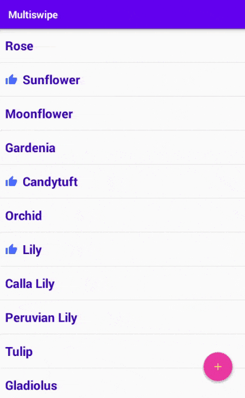

# Multiswipe

A swipe library for RecyclerView in Android.

## Table of Contents (Kotlin) [Java](README_JAVA.md)

- [Demo](#demo)
- [Requirements](#requirements)
- [Setup in Maven](#setup-in-maven)
- [Setup in Gradle](#setup-in-gradle)
- [Usage in Kotlin](#usage-in-kotlin)
- [Credits](#credits)
- [Copyright and License](#copyright-and-license)

## Demo

In the image below, you can see a demo app that uses this library:



*Each left and right sides could have zero, one or more swipe types.  
If user swipes greater than half of the view's width then only swipe action will be executed.  
Otherwise if there is more than one swipe type in current side and user swipes less than half of the view's width then swipe switches to next one.  
In this library, **half** of the view is called "**accept boundary**" and it could be any fraction that the developer chooses once for all recyclerview rows.*

As you see background color changes during each swipe because each swipe changes from active state to accept state. When swipe displacement is smaller than "accept boundary" swipe is in active state and when swipe displacement is greater than "accept boundary" swipe is in accept state. Each of these two states has its own theme, called activeTheme and acceptTheme. These themes consist of icon, label, background color, label color, ... and these themes could be customized separately for each row of recyclerview. 

As you see in above image, FAB hides when it is in same side with swipe icons. This is an optional choice for the developer and developer can easily hide views (or do any action) if needed at swipes. Also, developer can easily customize colors, icons, actions and many other properties of this library. 

## Requirements

The library requires Android **API level 16** or above.

You may use Maven or Gradle to build your app here is needed steps for both:

## Setup in Maven

If you are using Maven build system use these steps to add multiswipe library to your project.

1. Add the JitPack repository to your build file:

    ```maven
    <repositories>
        <repository>
            <id>jitpack.io</id>
            <url>https://jitpack.io</url>
        </repository>
    </repositories>
    ```

2. Add the dependency:

    ```maven
    <dependency>
        <groupId>com.github.ygngy</groupId>
        <artifactId>multiswipe</artifactId>
        <version>1.2.2</version>
    </dependency>
    ```

## Setup in Gradle

If you are using Gradle build system use these steps to add multiswipe library to your project.

1. Add `jitpack.io` to your project’s repositories. Your repositories list may be in `settings.gradle` file or in project’s root `build.gradle` file:

    ```groovy
    repositories {
        //...
        maven { url 'https://jitpack.io' }
    }
    ```

2. Add the required dependency to app's `build.gradle`:

    ```groovy
    dependencies {
        implementation 'com.github.ygngy:multiswipe:1.2.2'
    }
    ```

## Usage in Kotlin

`ViewHolder` must implement `MultiSwipe`:

```kotlin
interface MultiSwipe {
    val leftSwipeList: LeftSwipeList?
    val rightSwipeList: RightSwipeList?
    fun onSwipeDone(swipeId: Int): Any?
}
```

`leftSwipeList` and `rightSwipeList` must return swipe lists for left and right side or `null` for no swipe.  
Once swipe is done `onSwipeDone` will be called with `swipeId`. `onSwipeDone` is the method that we should do the `swipeId` action or return a value to do the action at activity or fragment.

### Create swipe lists at adapter's constructor or `ViewHolder`'s bind method
As said above you must return swipe lists for left and right side or null from `leftSwipeList` and `rightSwipeList`. But you should not create any object in these properties because they will be called every time a swipe starts or when swipe direction changes. So, we should create swipe lists before and only return it in these properties.
There are many ways to create swipes, below is a concise way using default colors. I will explain how to create custom swipes later:
```kotlin
// Each swipe contains of at least an id and an icon
val likeSwipe = Swipe(
        context = context, // context used to extract default colors and margins from resources
        id = SWIPE_TO_LIKE_ID, // swipe id will be sent to onSwipeDone when swipe is completed
        activeIcon = getDrawable(R.drawable.ic_like_24)!!, // swipe icon
        activeLabel = getString(R.string.like), // OPTIONAL swipe label
        acceptIcon = getDrawable(R.drawable.ic_like_accept_24)!!,// OPTIONAL icon used when swipe displacement is greater than "accept boundary"
        acceptLabel = getString(R.string.like_accept),// OPTIONAL label used when swipe swipe displacement is greater than "accept boundary"
        inactiveIcon = getDrawable(R.drawable.ic_disabled_like_24)!!// OPTIONAL icon used when this swipe could be next swipe
    )

// Create other swipes (shareSwipe, copySwipe, ...) in a similar way.

// If row has left swipes, create left swipe list in the desired order like below: 
mLeftSwipeList = LeftSwipeList (shareSwipe, copySwipe, cutSwipe)
// If row has right swipes, create right swipe list in the desired order like below:
mRightSwipeList = RightSwipeList (likeSwipe, editSwipe, delSwipe)
```

Swipe changes from active state to accept state. When swipe displacement is smaller than "accept boundary" swipe is in active state and when swipe displacement is greater than "accept boundary" swipe is in accept state. Each of these two states has its own theme, called activeTheme and acceptTheme. These themes consist of icon, label, background color, label color, ... and these themes could be customized separately.
In above constructor you can select different icons and labels for active and accept themes. 

### Return swipe lists from `leftSwipeList` and `rightSwipeList` of `ViewHolder` 

```kotlin
// Don't recreate swipes or any object here 
override val leftSwipeList: LeftSwipeList?
            get() = mLeftSwipeList
// Don't recreate swipes or any object here 
override val rightSwipeList: RightSwipeList?
            get() = mRightSwipeList
```

### At `onSwipeDone` of `ViewHolder` handle swipe event
Now you have implemented `leftSwipeList` and `rightSwipeList` of `MultiSwipe` interface in `ViewHolder` and you must implement `onSwipeDone` of it. 
Once swipe is done `onSwipeDone` will be called with `swipeId`. `onSwipeDone` is the method that we should do the `swipeId` action or return a value to do the action at activity or fragment. You can handle swipes here and/or return an optional value from this method that will be sent to an optional swipe listener in activity or fragment.
```kotlin
// Here handle swipe event and/or return some data to MultiSwipeListener 
override fun onSwipeDone(swipeId: Int): Any? {
    // Instead you may choose to only return data 
    // from this method to consume event at Activity or Fragment
    when(swipeId) {
        SWIPE_TO_SHARE_ID -> {
            // SHARE
        }
        SWIPE_TO_COPY_ID -> {
            // COPY
        }
        //...
    }
    return MyData()// return any data to Activity or Fragment
}
```

### At `Activity` or `Fragment` attach `MultiSwipeAdapter` to `RecyclerView`

This is the last step to setup this library.

```kotlin
import com.github.ygngy.multiswipe.multiSwiping // importing extension function

// in onCreate of Activity or Fragment:
recyclerView.multiSwiping(object: MultiSwipeListener { // OPTIONAL listener

                // This method is called after onSwipeDone of ViewHolder
                // and data is the returned value of onSwipeDone of ViewHolder
                override fun onSwipeDone(swipeId: Int, data: Any?) {
                    // data is the return value of "ViewHolder.onSwipeDone"
                    // cast to data you returned from "ViewHolder.onSwipeDone"
                    val myData = data as MyData?
                    when(swipeId) {
                        SWIPE_TO_SHARE_ID -> shareItem(myData)
                        SWIPE_TO_COPY_ID -> copyItem(myData)
                        //...
                    }
                }

                /*** 
                    This method will be called when direction changes in each swipe. 
                    This method could be used to hide on screen widgets such as FABs. 
                    direction may be: 
                        - START (when user opens start side of view), 
                        - END (when user opens end side of view), 
                        - NONE (when swipe is closing without user interaction)
                ***/
                override fun swiping(direction: SwipeDirection, swipeListSize: Int) {
                    // here i hide FAB when user is swiping end side actively
                    if (direction == SwipeDirection.END) fab.hide() else fab.show()
                }
            })
```

All `multiSwiping` arguments (even listener) are optional. But `multiSwiping` method has more optional arguments:
-	`listener`: An optional listener (`MultiSwipeListener`) to handle swipe events. 
-	`supportsRtl`: Is an optional Boolean argument and if it is true and layout direction is **RTL** then **left** swipe list will be used at **right** side and **right** list at **left** side of each row. Default value for this argument is false meaning left list is always on left side and right list is always on right side.
-	`hideInactiveIcons`: Is an optional Boolean argument and if it is true when swipe displacement is greater than "accept boundary", inactive icons will be hidden. Default value for this argument is true.
-	`swipeThreshold`: Determines "accept boundary" and is an optional `float` argument which is the fraction that the user should move the `view` to be considered as acceptable swipe. The fraction is calculated with respect to the view's bounds. Default value is .5f, which means, to swipe a `view`, user must move the `view` at least half of the `view`'s width. This value must be between 0 and 1. Default value is .5F.
-	`drawer`: Used to draw backgrounds, icons and labels for swipes. To change draws, use a custom subclass of `SwipeDrawerImpl` or implementation of `SwipeDrawer`. This argument should be used only in advanced situations where you need to override swipe draw events or draw something between drawing of background, icon, label and view. There is no need to use this argument just to change colors and icons. At next section I will show you how change colors and icons easily **without** using `drawer`. 


Listener argument in `multiswiping` function is an object implementing interface: `MultiSwipeListener`. This interface has two methods: `onSwipeDone` and `swiping`.
-	`onSwipeDone` method of this interface is the last place to handle swipe action. when swipe is done `onSwipeDone` of `MultiSwipeListener` is called after `onSwipeDone` method of `ViewHolder`. This method receives swipe id and any object returned from `onSwipeDone` of `ViewHolder`. Remember that `ViewHolder` must implement `MultiSwipe` interface which has `onSwipeDone` method.
-	`swiping` method is called when user swipes (moves) view. This method has two arguments, `SwipeDirection` which specifies swipe state and is an enum and may be `START` when user opens view’s start side, `END` when user opens view’s end side or `NONE` for swipe closing without user interaction. Second argument is `swipeListSize` which specifies the number of available swipes in that side and dictates the number of swipe icons and required vision space in that side. In this method you may hide some on screen views such as FABs or Floating Action Buttons that are covering swipe icons.


At this point all setups are done however if you want to customize backgrounds, color of labels, label size or margins read next section.

------------------------------------------------


## How to create custom Swipe themes
Swipe lists for left and right side is represented with `LeftSwipeList` and `RightSwipeList` classes. These classes get `Swipe` objects in constructor. So, to create swipes you need to create objects of type `Swipe`. This section explains how to create custom swipes. 

The simplest way to create swipe is the constructor that only needs icons and labels and uses default colors and margins:

```kotlin
// Each swipe contains of at least an id and an icon
val likeSwipe = Swipe(
        context = context, // context used to extract default colors and margins from resources
        id = SWIPE_TO_LIKE_ID, // swipe id will be sent to onSwipeDone when swipe is completed
        activeIcon = getDrawable(R.drawable.ic_like_24)!!, // swipe icon
        activeLabel = getString(R.string.like), // OPTIONAL swipe label
        acceptIcon = getDrawable(R.drawable.ic_like_accept_24)!!,// OPTIONAL icon used when swipe displacement is greater than "accept boundary"
        acceptLabel = getString(R.string.like_accept),// OPTIONAL label used when swipe displacement is greater than "accept boundary"
        inactiveIcon = getDrawable(R.drawable.ic_disabled_like_24)!!// OPTIONAL icon used when this swipe could be next swipe
    )
```
But if you want to customize colors or margins you need to use another `Swipe` constructor instead of above constructor. This constructor needs two swipe themes (instead of icon and label) for two states of swipe:

```kotlin
// Each swipe contains of at least an id and a theme and optionally acceptTheme and inactiveIcon
val shareSwipe = Swipe (
       id = SWIPE_TO_SHARE_ID,// swipe id will be sent to onSwipeDone
       activeTheme = shareTheme,// theme used when user is interacting with this swipe
       acceptTheme = shareAcceptTheme,// OPTIONAL accept theme (default is same as activeTheme). Is used when swipe displacement is greater than "accept boundary"
       inactiveIcon = getDrawable(R.drawable.ic_disabled_share_24)!!// OPTIONAL icon used when this swipe could be next swipe
)
```
Swipe changes from active state to accept state. When swipe displacement is smaller than "accept boundary" swipe is in active state and when swipe displacement is greater than "accept boundary" swipe is in accept state. Each of these two states has its own `SwipeTheme`, called **activeTheme** and **acceptTheme** in the code above. These themes consist of icon, label, background color, label color, ... and these themes could be customized separately. 


To use this constructor, you need to create objects of type `SwipeTheme`. The `SwipeTheme` has two constructors if you do **NOT** need to customize label **size** or **margins** you can use following constructor: 

```kotlin
SwipeTheme (
        context: Context, // used to extract default values from resources.
        icon: Drawable, // a drawable used to draw swipe icon.
        label: String?, // optional label to explain swipe action.
        isAcceptTheme: Boolean, // used to select default colors for label and backgrounds (default value is false)
        labelColor: Int, // color used to draw label (if isAcceptTheme is true default is pale red otherwise default is pale green)
        backgroundColor: Int, // color used to draw background below icon and label (if isAcceptTheme is true default is red otherwise default is green)
        viewColor: Int // color used to draw view background (in day theme of Android, if isAcceptTheme is true default is pale red otherwise is pale green. in night theme of Android, view background may be gray or black)
)
```

If you specify all color arguments of this constructor then no default color will be used thus `isAcceptTheme` argument becomes ineffective. But if you do not specify a color argument in this constructor `isAcceptTheme` distinguishes default color for that.

If you do not need to customize labels size or margins between icons and labels then you can skip to next section. Below classes is only needed for customizing text size and margins between text and icons. 

Second constructor of `SwipeTheme` only is needed to customize text size and margins in addition to colors.

```kotlin
SwipeTheme (
       icon: SwipeIcon, // contains swipe's icon and margin between icons.
       label: SwipeLabel?, // optional label contains text, text color, text size and margin between text and icon
       backgroundColor: Int, // will be drawn fully below icons and texts and rows of recyclerView (here default is transparent).
       viewColor: Int // view’s background which is above swipe icons and text (here default is transparent).
)
```

Usage:
```kotlin
val shareTheme = SwipeTheme (
        icon = shareIcon,// swipe icon
        label = shareLabel,// OPTIONAL swipe label (could be null)
        backgroundColor = getColor(R.color.swipe_background),// background color for swipes
        viewColor = getColor(R.color.view_background_color)// OPTIONAL color to use for itemView's background
        // To hide icons and label below each recyclerView's item you have to use viewColor OR layout background
        // viewColor is visible only if recyclerView's item layout don't have a background
)
```


There is two options to hide swipe icons below view: background color in view's layout file or `viewColor` here.

To use above constructor, you need to create object of `SwipeIcon` and optionally (if you want a label) `SwipeLabel`. Below is constructor definition of these classes. 
If you want to customize label’s size or margin you need to use this constructor of `SwipeLabel`:

```kotlin
 SwipeLabel (
      val text: String, // text of the label
      val textColor: Int, // text color of the label
      val textSize: Float, // text size of the label
      val margin: Float // margin between text and the icon next to it
)
```

Usage:

```kotlin
// Create an OPTIONAL swipe label
val shareLabel = SwipeLabel(
        text = getString(R.string.share_label),// label's text
        textColor = getColor(R.color.swipe_text),// label's text color
        textSize = getDimension(R.dimen.swipe_text_size),// label's text size
        margin = getDimension(R.dimen.swipe_text_margin),// margin between label and last icon
)
```

You can use following constructor to customize margins between icons:
```kotlin
SwipeIcon (
      drawable: Drawable, // drawable will be drawn as swipe icon.
      edgeHorMargin: Float, // horizontal margin between this active icon and edge of view.
      iconHorMargin: Float, // horizontal margin between this active icon and first inactive icon (if there is any other icons).
      tailHorMargin: Float // horizontal margin between inactive icons when this icon is active and there is more than one inactive icon.
)
```
Usage:
```kotlin
// Setting swipe icon and margins
val shareIcon = SwipeIcon(drawable = getDrawable(R.drawable.ic_baseline_share_24)!!,
        edgeHorMargin = getDimension(R.dimen.swipe_edge_margin),// margin between edge of the view and this icon
        iconHorMargin = getDimension(R.dimen.swipe_icon_margin),// margin between this icon and first inactive icon
        tailHorMargin = getDimension(R.dimen.swipe_tail_margin)// same margin used for separating inactive icons
)
```

## Best Practices

- **Reusing objects**: 
Creating above classes may look cumbersome, but all above classes are `data` class in Kotlin and you can use `copy` method of `data` class instead of creating a brand-new object. For instance, instead of creating a theme for accepting a swipe you can `copy` a theme with new values:

```kotlin
val shareAcceptTheme = shareTheme.copy(
        backgroundColor = getColor(R.color.swipe_accept_background),
        label = shareLabel.copy(textColor = getColor(R.color.swipe_accept_text)),
        viewColor = getColor(R.color.view_background_accept_color)
)
```
Or even you may create only one theme and copy it for all other themes:

```kotlin
val delTheme = likeTheme.copy(
        icon = getDrawable(R.drawable.ic_del_24dp)!!,
        label = likeLabel.copy(text = getString(R.string.del))
)
val shareTheme = likeTheme.copy(
        icon = getDrawable(R.drawable.ic_share_24dp)!!,
        label = likeLabel.copy(text = getString(R.string.share))
)
```

You can see a good example of reusing classes in demo app of library [here](https://github.com/ygngy/multiswipe/blob/main/demo/src/main/java/com/github/ygngy/demo/swipesample/SwipeCreator.kt).

- **Create objects once**: 
The recycler view may have many rows and many rows may have similar swipe actions. Instead of repeatedly creating swipes for every row, you should create each swipe type once and reuse it in all rows. You can create a special factory class that creates all swipes in constructor and exposes them as class property like [this](https://github.com/ygngy/multiswipe/blob/main/demo/src/main/java/com/github/ygngy/demo/swipesample/SwipeCreator.kt) and [this](https://github.com/ygngy/multiswipe/blob/main/demo/src/main/java/com/github/ygngy/demo/swipesample/DefaultSwipeCreator.kt) then create only one instance of this class at recyclerview [adapter](https://github.com/ygngy/multiswipe/blob/main/demo/src/main/java/com/github/ygngy/demo/swipesample/RecyclerDemoAdapter.kt) as in demo app.

- Do not create any object in `leftSwipeList` and `rightSwipeList` of `MultiSwipe`
As previously said `ViewHolder` must implement `MultiSwipe` interface and get swipe lists in `leftSwipeList` and `rightSwipeList` properties. But these properties will be called **every time** a swipe starts or when swipe direction changes, so you should not create any object in these properties. Because if you create objects in these properties, extra objects will be created in memory. Also creating objects in these properties may slows down swipe animations because creating objects may be time consuming.
If your swipes are repetitive in rows then best location for creating swipes is in adapter of recyclerView  because it will be created once. But if your swipes are not similar in rows and swipe actions and themes are very dependent to the content of the row then best location to create swipes is in bind method of ViewHolder.


---------------------------------------------------------------------------

## Credits

Creator: **"Mohamadreza Amani Yeganegi"**  
My Email: [ygnegy@gmail.com](mailto:ygnegy@gmail.com)
Email: [help4usr@gmail.com](mailto:help4usr@gmail.com)
My Github Profile: [https://github.com/ygngy](https://github.com/ygngy)  

## Copyright and License

### Copyright © 2022 "Mohamadreza Amani Yeganegi"  

Licensed under the [MIT license](LICENSE)
