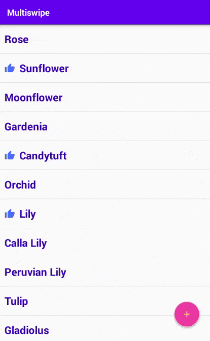

# Multiswipe

A swipe library for RecyclerView in Android.

## Table of Contents (Java) [Kotlin](README.md)

- [Demo](#demo)
- [Requirements](#requirements)
- [Setup in Maven](#setup-in-maven)
- [Setup in Gradle](#setup-in-gradle)
- [Usage in Java](#usage-in-java)
- [Credits](#credits)
- [Copyright and License](#copyright-and-license)

## Demo

Below watch the **Multiswipe** library in action:



*Each left and right sides could have zero, one or more swipes.  
If user swipes greater than half of the view's width then only swipe action will be executed.  
Otherwise if there is more than one swipe (in each side) and user swipes less than half of the view's width then swipe switches to next one.  
Here **half** of the view could be any fraction that the developer chooses.*

## Requirements

The library requires Android **API level 16+**.

## Setup in Maven

1. Add the JitPack repository to your build file:

    ```maven
    <repositories>
        <repository>
            <id>jitpack.io</id>
            <url>https://jitpack.io</url>
        </repository>
    </repositories>
    ```

2. Add the dependency:

    ```maven
    <dependency>
        <groupId>com.github.ygngy</groupId>
        <artifactId>multiswipe</artifactId>
        <version>1.1.0</version>
    </dependency>
    ```

## Setup in Gradle

1. Add it in project's root `build.gradle` at the end of repositories:

    ```groovy
    allprojects {
        repositories {
            //...
            maven { url 'https://jitpack.io' }
        }
    }
    ```

2. Add the dependency to app's `build.gradle`:

    ```groovy
    dependencies {
        implementation 'com.github.ygngy:multiswipe:1.1.0'
    }
    ```

## Usage in Java

`ViewHolder` must implement `MultiSwipe`:

```java
public interface MultiSwipe {
    @Nullable
    LeftSwipeList getLeftSwipeList();

    @Nullable
    RightSwipeList getRightSwipeList();

    @Nullable
    Object onSwipeDone(int swipeId);
}
```

`getLeftSwipeList` and `getRightSwipeList` must return swipe lists for left and right side or `null` for no swipe.  
`onSwipeDone` will be called with `swipeId` when user swipes.

### Create swipe lists at `ViewHolder`'s bind method

```java
// Setting swipe icons and margins

SwipeIcon shareIcon = new SwipeIcon(
    getDrawable(R.drawable.ic_baseline_share_24),// icon's drawable
    getDimension(R.dimen.swipe_edge_margin),// margin between edge of view and first icon
    getDimension(R.dimen.swipe_icon_margin),// margin between first icon and second icon
    getDimension(R.dimen.swipe_tail_margin)// same margin used for separating other icons
);

// Create an optional swipe label
SwipeLabel shareLabel = new SwipeLabel(
    getString(R.string.share_label),// label's text
    getColor(R.color.swipe_text),// label's text color
    getDimension(R.dimen.swipe_text_size),// label's text size
    getDimension(R.dimen.swipe_text_margin)// margin between label and last icon
);

// Create a `SwipeTheme` for each swipe
SwipeTheme shareTheme = new SwipeTheme(
        shareIcon,// swipe icon
        shareLabel,// optional swipe label (could be null)
        getColor(R.color.swipe_background),// background color for swipes
        getColor(R.color.view_background_color)// optional color to use for itemView's background
        // To hide icons and label below each recyclerView's item you have to use viewColor OR layout background
        // viewColor is visible only if recyclerView's item layout don't have a background
);

// Create an optional swipe label for when user swipes enough to accept
SwipeLabel shareAcceptLabel = new SwipeLabel(
        getString(R.string.share_label),// accept label's text
        getColor(R.color.swipe_accept_text),// accept label's text color
        getDimension(R.dimen.swipe_text_size),// accept label's text size
        getDimension(R.dimen.swipe_text_margin)// margin between label and last icon
);

// You can create an optional accept theme to use when swipe is in accept state
SwipeTheme shareAcceptTheme = new SwipeTheme(
        shareIcon,// swipe's accept icon (could be different for accepted swipes)
        shareAcceptLabel,// optional swipe's accept label (could be null)
        getColor(R.color.swipe_accept_background),// background color for accepted swipe
        getColor(R.color.view_background_accept_color)// optional color to use for itemView's background
);

// Each swipe contains of at least an id and a theme and optionally acceptTheme and inactiveIcon
Swipe shareSwipe = new Swipe(
        SWIPE_TO_SHARE_ID,// swipe id will be sent to onSwipeDone
        shareTheme,// theme used when user is interacting with this swipe
        shareAcceptTheme,// optional accept theme (default is same as activeTheme)
        getDrawable(R.drawable.ic_disabled_share_24)// optional icon used for inactive themes
);

// If row has left swipes create left swipe list in the desired order
mLeftSwipeList = new LeftSwipeList(shareSwipe, copySwipe, cutSwipe);
// If row has right swipes create right swipe list in the desired order
mRightSwipeList = new RightSwipeList(likeSwipe, editSwipe, delSwipe);
```

### Return swipe lists from `getLeftSwipeList` and `getRightSwipeList`  

```java
@Nullable
@Override
public LeftSwipeList getLeftSwipeList() {
    // Don't recreate swipes or any object here
    return mLeftSwipeList;
}

@Nullable
@Override
public RightSwipeList getRightSwipeList() {
    // Don't recreate swipes or any object here
    return mRightSwipeList;
}
```

### At `onSwipeDone` of `ViewHolder` handle swipe event

```java
@Nullable
@Override
public Object onSwipeDone(int swipeId) {
    // Here handle swipe event and return some data to MultiSwipeListener
    // Instead you may choose to only return data
    // from this method to consume event at Activity or Fragment
    switch (swipeId) {
        case SWIPE_TO_SHARE_ID:
            // share
            break;
        case SWIPE_TO_COPY_ID:
            // copy
            break;
        //...
    }
    return new MyData();// return any data to Activity or Fragment
}
```

### At `Activity` or `Fragment` attach `MultiSwipeAdapter` to `RecyclerView`

```java
multiSwiping(recyclerView, new MultiSwipeListener() { // optional listener
        // This method is called after onSwipeDone of ViewHolder
        // and data is the returned value of onSwipeDone of ViewHolder
        @Override
        public void onSwipeDone(int swipeId, @Nullable Object data) {
            // data is the return value of "ViewHolder.onSwipeDone"
            // cast to data you returned from "ViewHolder.onSwipeDone"
            MyData myData = (MyData) data;
            switch (swipeId) {
                case SWIPE_TO_SHARE_ID:
                    shareItem(myData);
                    break;
                case SWIPE_TO_COPY_ID:
                    copyItem(myData);
                    break;
                //...
            }
        }

        // This method could be used to clear on screen widgets such as FABs
        // direction may be START, END, NONE
        @Override
        public void swiping(@NotNull SwipeDirection direction, int swipeListSize) {
            // here i hide FAB when user is swiping end side actively
            if (direction == SwipeDirection.END) fab.hide();
            else fab.show();
        }
    });
```

## Credits

Creator: **"Mohamadreza Amani Yeganegi"**  
My Email: [ygnegy@gmail.com](mailto:ygnegy@gmail.com)  
My Github Profile: [https://github.com/ygngy](https://github.com/ygngy)  

## Copyright and License

### Copyright (c) 2021 "Mohamadreza Amani Yeganegi"  

Licensed under the [MIT license](LICENSE)
